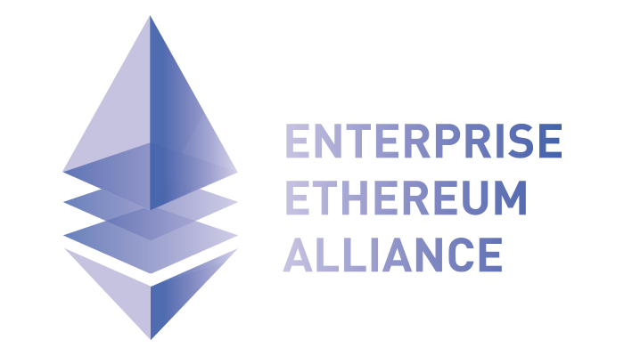

<p align="center">
  </img>
  <h3 align="center"><b>M e t h W</b></h3>
  <p align="center">Multitenant High Performance Ethereum Webapi</p>
</p>

Welcome to **methw** project.

A multitenant High Performance Ethereum Webapi for smart contract inter-communication.

## Usage

## Dependencies by size

Following, **methw** dependencies are listed, orderer by impact on final executable size:

```bash
3.4 MB net/http
3.0 MB runtime
1.7 MB net
1.4 MB reflect
932 kB crypto/tls
870 kB math/big
713 kB syscall
630 kB crypto/x509
626 kB text/template
596 kB encoding/xml
594 kB github.com/zerjioang/methw/vendor/github.com/labstack/echo
546 kB encoding/json
509 kB html/template
509 kB text/template/parse
457 kB github.com/zerjioang/methw/vendor/github.com/labstack/echo/middleware
447 kB vendor/golang_org/x/text/unicode/norm
424 kB time
402 kB regexp/syntax
395 kB vendor/golang_org/x/net/dns/dnsmessage
388 kB fmt
351 kB regexp
349 kB github.com/zerjioang/methw/vendor/golang.org/x/crypto/acme
337 kB github.com/zerjioang/methw/vendor/golang.org/x/crypto/acme/autocert
327 kB compress/flate
319 kB os
283 kB crypto/elliptic
271 kB encoding/asn1
259 kB vendor/golang_org/x/crypto/cryptobyte
246 kB strconv
240 kB vendor/golang_org/x/text/unicode/bidi
230 kB strings
229 kB net/http/httputil
225 kB unicode
211 kB github.com/zerjioang/methw/vendor/github.com/dgrijalva/jwt-go
204 kB math
199 kB vendor/golang_org/x/net/idna
186 kB mime
179 kB html
179 kB internal/poll
177 kB bytes
170 kB bufio
167 kB vendor/golang_org/x/net/http2/hpack
163 kB crypto/rsa
154 kB encoding/binary
152 kB net/textproto
148 kB net/url
148 kB mime/multipart
140 kB crypto/cipher
132 kB io
120 kB sync
112 kB sort
111 kB runtime/cgo
98 kB vendor/golang_org/x/text/transform
98 kB crypto/aes
96 kB math/rand
94 kB vendor/golang_org/x/crypto/chacha20poly1305
93 kB context
90 kB github.com/zerjioang/methw/vendor/github.com/labstack/gommon/log
90 kB path/filepath
87 kB crypto/ecdsa
84 kB github.com/zerjioang/methw/core
78 kB crypto/sha512
72 kB encoding/base64
72 kB crypto/sha256
69 kB crypto/sha1
68 kB github.com/zerjioang/methw/vendor/github.com/labstack/gommon/color
67 kB crypto/x509/pkix
66 kB compress/gzip
65 kB vendor/golang_org/x/net/http/httpproxy
62 kB github.com/zerjioang/methw/core/handlers
60 kB net/http/internal
59 kB github.com/zerjioang/methw/vendor/github.com/valyala/fasttemplate
57 kB net/http/httptrace
55 kB io/ioutil
55 kB container/list
54 kB hash/crc32
53 kB github.com/zerjioang/methw/shared
52 kB crypto/rand
51 kB log
48 kB crypto/des
47 kB github.com/zerjioang/methw/vendor/github.com/valyala/bytebufferpool
45 kB crypto/md5
44 kB encoding/pem
42 kB encoding/hex
40 kB vendor/golang_org/x/crypto/internal/chacha20
39 kB mime/quotedprintable
38 kB vendor/golang_org/x/text/secure/bidirule
36 kB crypto/dsa
32 kB internal/cpu
31 kB path
30 kB vendor/golang_org/x/crypto/curve25519
26 kB vendor/golang_org/x/net/http/httpguts
26 kB unicode/utf8
25 kB internal/singleflight
24 kB crypto
24 kB math/bits
22 kB github.com/zerjioang/methw/vendor/github.com/mattn/go-colorable
19 kB crypto/rc4
18 kB sync/atomic
17 kB github.com/zerjioang/methw/vendor/github.com/labstack/gommon/bytes
17 kB vendor/golang_org/x/crypto/poly1305
15 kB internal/bytealg
14 kB hash
14 kB crypto/hmac
13 kB internal/testlog
11 kB runtime/internal/sys
10 kB runtime/internal/atomic
8.7 kB github.com/zerjioang/methw/vendor/github.com/labstack/gommon/random
8.0 kB unicode/utf16
7.7 kB crypto/internal/randutil
6.7 kB encoding
6.0 kB vendor/golang_org/x/crypto/cryptobyte/asn1
5.7 kB crypto/subtle
5.6 kB internal/syscall/unix
4.2 kB internal/nettrace
3.6 kB internal/race
3.4 kB errors
3.2 kB github.com/zerjioang/methw/vendor/github.com/mattn/go-isatty
3.1 kB crypto/internal/subtle
1.8 kB github.com/zerjioang/methw/core/util
```

## License

All rights reserved.

Redistribution and use in source and binary forms, with or without modification, are permitted provided that the following conditions are met:

 * Redistributions of source code must retain the above copyright notice, this list of conditions and the following disclaimer.
 * Redistributions in binary form must reproduce the above copyright notice, this list of conditions and the following disclaimer in the documentation and/or other materials provided with the distribution.
 * Uses GPL license described below

This program is free software: you can redistribute it and/or modify it under the terms of the GNU General Public License as published by the Free Software Foundation, either version 3 of the License, or (at your option) any later version.